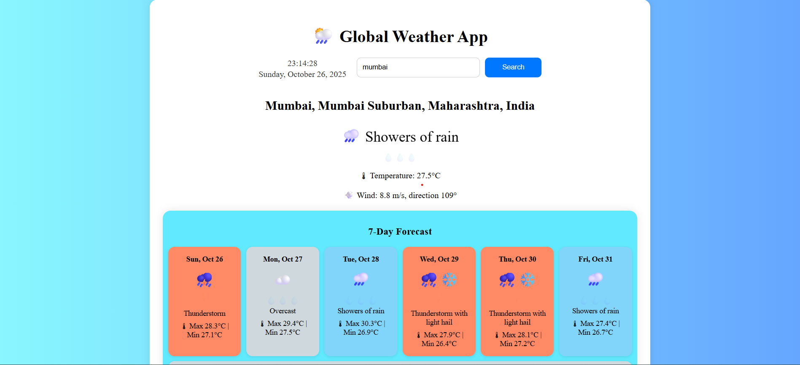
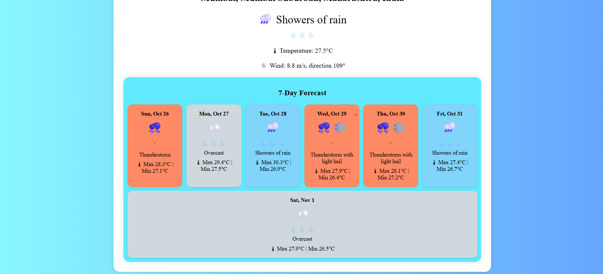

# 🌦️ Global Weather App

[](https://developer.mozilla.org/en-US/docs/Web/HTML) [](https://developer.mozilla.org/en-US/docs/Web/CSS) [](https://developer.mozilla.org/en-US/docs/Web/JavaScript) [](LICENSE)  

A **responsive weather app** that displays **real-time weather** and a **7-day forecast** for any city, village, or country. Built using **JavaScript, HTML, CSS**, and free public APIs.

---

## 📌 Table of Contents

1. [Features](#-features)  
2. [Screenshots](#-screenshots)  
3. [How to Use](#-how-to-use)  
4. [APIs Used](#-apis-used)  
5. [Technologies](#-technologies)  
6. [Future Enhancements](#-future-enhancements)  
7. [License](#-license)  
8. [Author](#-author)  

---

## 🌟 Features

- Current weather for any location  
- 7-day weather forecast  
- Weather icons and dynamic backgrounds based on weather type  
- Live **clock and date** display  
- Fully **responsive design** for desktop, tablet, and mobile  
- Smooth animations for weather icons  

---

## 📸 Screenshots

  
  


---

## 🚀 How to Use

1. Clone the repository:

```bash
git clone https://github.com/Tanweerjmi/Weather-App.git


## 🌐 APIs Used 
Open-Meteo API
 – Weather data

Nominatim OpenStreetMap API
 – Geolocation

## 💻 Technologies

HTML5 – Structure

CSS3 – Styling, responsiveness, and animations

JavaScript – Fetching and processing weather data

Free public APIs


## 🔮 Future Enhancements

Temperature toggle (Celsius ↔ Fahrenheit)

Search history with autocomplete

More weather metrics (humidity, pressure, UV index)

Dark mode support

📄 License

This project is licensed under the MIT License – see the LICENSE
 file for details.

## ✨ Author

Md Tanweer Alam

GitHub: https://github.com/yourusername

Portfolio: https://tanweerportfolio.gt.tc/